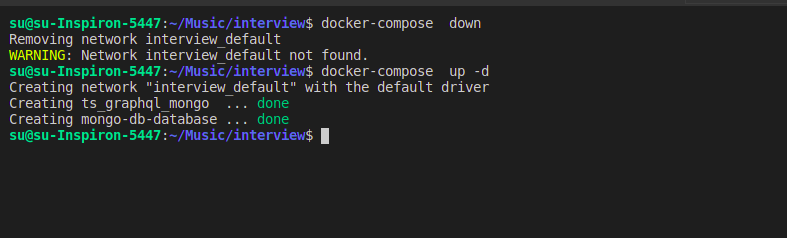
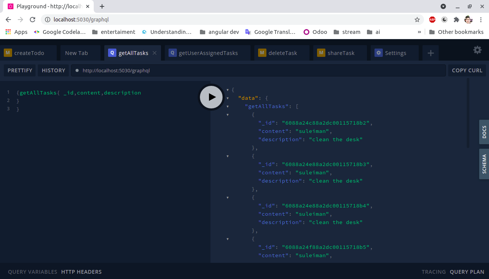

# mongo graphQL typescript node-js todoList

graphql\
appolo\
mongoose\
node js\
typescript\ 
npm \
mongo\ 
docker docker-compose\

## Getting Started

an open source project 

### Prerequisites
graphql\
appolo\
mongoose\
node js\
typescript \
npm \
mongo \
docker docker-compose\


### confugure the env file 
env file contains  projecect config\
PORT=5030\
GRAPHQL_PATH=/graphql\
NODE_ENV=development\
REDIS_PORT=6379\
REDIS_HOST=localhost\
MONGODB_URI=[your mongo adress]\
ssl=false\

### Installing dev mode

clone or download the project  \
npm install or yarn install\
npm start \

here is your services is running  🚀 🚀 🚀 🚀 🚀 
http://localhost:5030/graphql
 

### using docker compose 
build node ts image \
```
 sudo docker build  -t ts-graphql-mongo .
 ```
 
excute compose file 

```
sudo docker-compose up -d 
```
shut down  all containers 

```
sudo docker-compose down
```



### creation  

```
npm init -y   
```

```
mkdir src 
``` 

```
touch index.ts  
```
```
npm install -g typescript
```
```
tsc --init  // generate tsconfig.json file
```
```
tslint --init // generate tslint file
```

...see the package.json for 


 